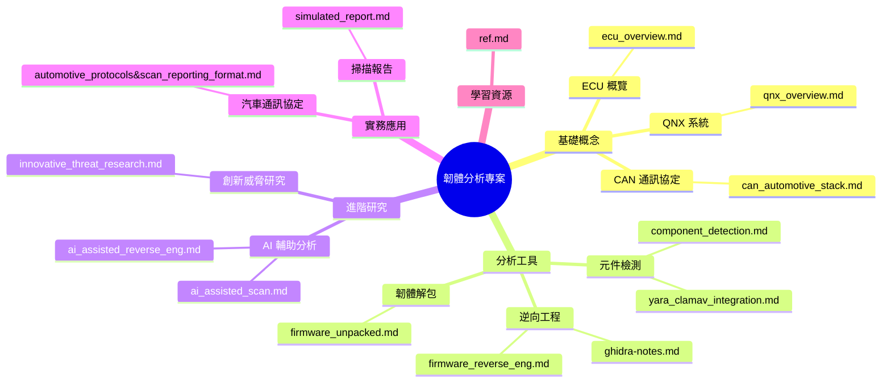
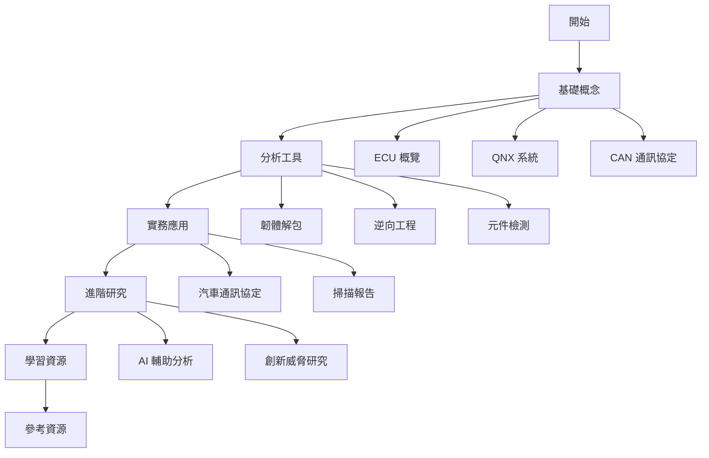

# 🔍 firmware-reverse-enginnering-docs&tutorials

本專案展示了韌體分析方面相關概念跟資料以及文件：

## 文件架構



## 建議閱讀順序



### 1. 基礎概念

1. `ecu_overview.md` - 了解 ECU 的基本概念和功能
2. `qnx_overview.md` - 認識 QNX 系統及其在車用系統的應用
3. `can_automotive_stack.md` - 學習 CAN 通訊協定的基礎知識

### 2. 分析工具

1. `firmware_unpacked.md` - 學習韌體解包的基本工具和方法
2. `firmware_reverse_eng.md` - 了解韌體逆向工程的基本流程
3. `ghidra-notes.md` - 學習使用 Ghidra 進行分析
4. `component_detection.md` - 了解元件檢測的方法
5. `yara_clamav_integration.md` - 學習使用 YARA 進行特徵檢測

### 3. 實務應用

1. `automotive_protocols&scan_reporting_format.md` - 了解汽車通訊協定的實際應用
2. `simulated_report.md` - 學習如何撰寫韌體分析報告

### 4. 進階研究

1. `ai_assisted_reverse_eng.md` - 了解 AI 在韌體分析中的應用
2. `ai_assisted_scan.md` - 學習 AI 輔助掃描的方法
3. `innovative_threat_research.md` - 探索創新的威脅研究方法

### 5. 學習資源

1. `ref.md` - 獲取更多學習資源和參考資料

## 直接使用：

```bash
docker pull dennisleetw/firmware-analyzer
```

```bash
container port set to 3000:3000
```


```bash
open localhost:3000
```


---

## Demo:

https://youtu.be/J5Wb_5GvQmA

---

## 📦 專案結構

```bash
firmware-analysis-demo/
├── firmware.bin                 # 樣本韌體映像檔
├── binwalk-analysis/            # 使用binwalk解包的目錄
├── hexdump-analysis/            # 原始十六進位 + 偏移註釋
├── yara-rules/                  # YARA規則與檢測結果
│   ├── telnetd_rule.yar         # 檢測telnet服務的規則
│   └── network_services_rule.yar # 檢測多種網路服務的規則
├── ghidra-notes.md              # 字串/函數參考 + 註釋
├── simulated_report.md          # 特徵檢測摘要
├── can-log-demo.txt             # 模擬CAN協議片段
├── screenshots/                 # 分析工具截圖
├── firmware_samples/            # 韌體樣本儲存目錄
├── reports/                     # 分析報告輸出目錄
├── firmware_analyzer.sh         # 自動化分析腳本
├── setup_cron.sh                # 定時任務設置腳本
├── Dockerfile                   # Docker映像定義
├── docker-compose.yml           # Docker環境配置
└── README.md                    # 本文檔
```

## 🛠️ 使用工具

| 工具    | 用途                  |
| ------- | --------------------- |
| binwalk | 韌體提取與分析        |
| hexdump | 原始數據檢查          |
| Ghidra  | 二進制分析 + 字串映射 |
| YARA    | 基於規則的特徵匹配    |
| Docker  | 環境容器化與部署      |
| Cron    | 自動化定期執行分析    |
