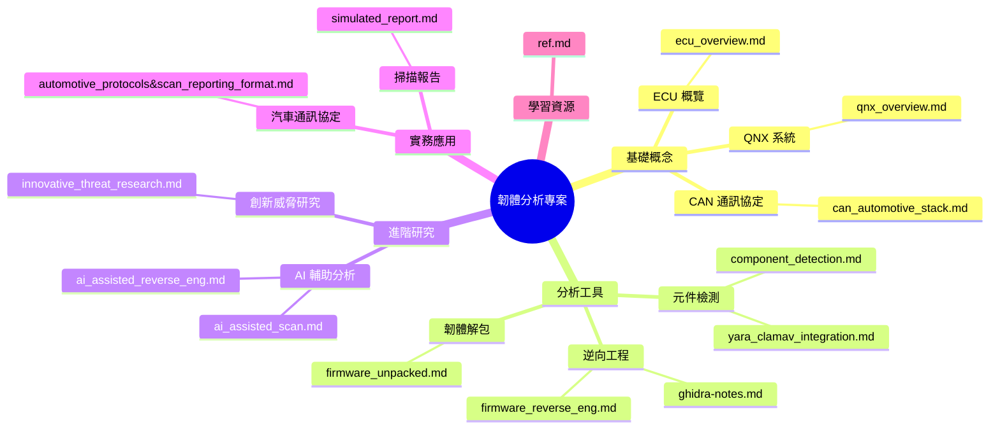
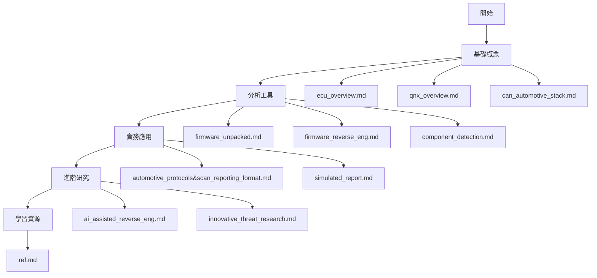

# 🔍 firmware-reverse-enginnering-docs&tutorials

本專案展示了韌體分析方面相關概念跟資料以及文件：

## 文件架構

## 建議閱讀順序

### 1. 基礎概念

1. `ecu_overview.md` - 了解 ECU 的基本概念和功能
2. `qnx_overview.md` - 認識 QNX 系統及其在車用系統的應用
3. `can_automotive_stack.md` - 學習 CAN 通訊協定的基礎知識

### 2. 分析工具

1. `firmware_unpacked.md` - 學習韌體解包的基本工具和方法
2. `firmware_reverse_eng.md` - 了解韌體逆向工程的基本流程
3. `ghidra-notes.md` - 學習使用 Ghidra 進行分析
4. `component_detection.md` - 了解元件檢測的方法
5. `yara_clamav_integration.md` - 學習使用 YARA 進行特徵檢測

### 3. 實務應用

1. `automotive_protocols&scan_reporting_format.md` - 了解汽車通訊協定的實際應用
2. `simulated_report.md` - 學習如何撰寫韌體分析報告

### 4. 進階研究

1. `ai_assisted_reverse_eng.md` - 了解 AI 在韌體分析中的應用
2. `ai_assisted_scan.md` - 學習 AI 輔助掃描的方法
3. `innovative_threat_research.md` - 探索創新的威脅研究方法

### 5. 學習資源

1. `ref.md` - 獲取更多學習資源和參考資料
