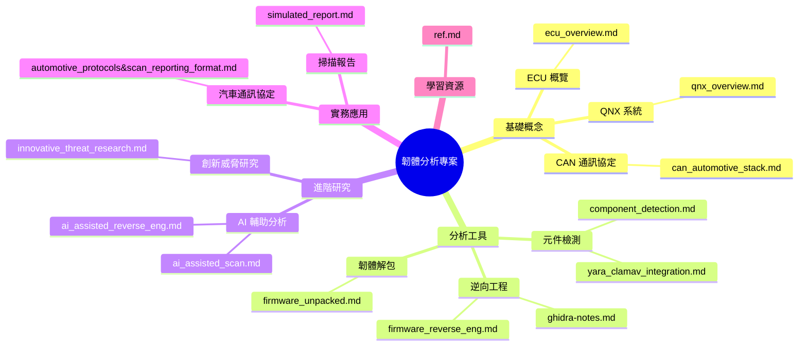
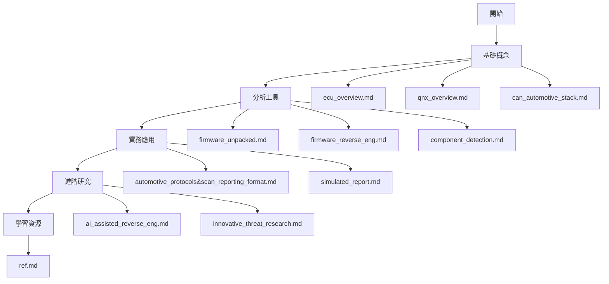

# 🔍 firmware-reverse-enginnering-docs&tutorials

本專案展示了韌體分析方面相關概念跟資料以及文件：

## 文件架構



## 建議閱讀順序



### 1. 基礎概念

1. `ecu_overview.md` - 了解 ECU 的基本概念和功能
2. `qnx_overview.md` - 認識 QNX 系統及其在車用系統的應用
3. `can_automotive_stack.md` - 學習 CAN 通訊協定的基礎知識

### 2. 分析工具

1. `firmware_unpacked.md` - 學習韌體解包的基本工具和方法
2. `firmware_reverse_eng.md` - 了解韌體逆向工程的基本流程
3. `ghidra-notes.md` - 學習使用 Ghidra 進行分析
4. `component_detection.md` - 了解元件檢測的方法
5. `yara_clamav_integration.md` - 學習使用 YARA 進行特徵檢測

### 3. 實務應用

1. `automotive_protocols&scan_reporting_format.md` - 了解汽車通訊協定的實際應用
2. `simulated_report.md` - 學習如何撰寫韌體分析報告

### 4. 進階研究

1. `ai_assisted_reverse_eng.md` - 了解 AI 在韌體分析中的應用
2. `ai_assisted_scan.md` - 學習 AI 輔助掃描的方法
3. `innovative_threat_research.md` - 探索創新的威脅研究方法

### 5. 學習資源

1. `ref.md` - 獲取更多學習資源和參考資料

# 韌體分析工具集

這是一個用於分析韌體安全的工具集，包含多種分析工具和腳本。

## 目錄結構

```
.
├── firmware_samples/    # 韌體樣本
├── yara_rules/         # YARA 規則
├── unpacked/           # 解包後的韌體
├── reports/            # 分析報告
│   ├── raw/           # 原始分析結果
│   ├── processed/     # 處理後的分析結果
│   └── summary/       # 總結報告
├── tools/             # 工具目錄
│   └── volatility3/   # 記憶體分析工具
└── scripts/           # 分析腳本
```

## 安裝說明

1. 執行初始化腳本：

```bash
chmod +x scripts/init-firmwar-analysis.sh
./scripts/init-firmwar-analysis.sh
```

2. 啟動虛擬環境：

```bash
source ~/.zshrc
pyenv activate firmware-analysis
```

## 工具說明

### 1. 韌體分析器 (firmware_analyzer.py)

基本功能：

- 自動載入 YARA 規則
- 分析韌體檔案類型
- 執行 YARA 規則掃描
- 生成分析報告

使用方法：

```bash
python scripts/firmware_analyzer.py
```

### 2. YARA 規則

預設規則：

- detect_telnetd: 檢測 telnet 服務
- detect_busybox: 檢測 BusyBox
- detect_libcrypto: 檢測 OpenSSL 相關組件

### 3. 其他工具

- binwalk: 韌體解包工具
- volatility3: 記憶體分析工具
- yara: 特徵碼掃描工具

## 使用流程

1. 準備韌體樣本：

   - 將韌體檔案放入 `firmware_samples/` 目錄

2. 執行分析：

   ```bash
   python scripts/firmware_analyzer.py
   ```

3. 查看報告：
   - 原始分析結果：`reports/raw/`
   - 處理後結果：`reports/processed/`
   - 總結報告：`reports/summary/`

## 建議閱讀順序

1. [韌體分析基礎](docs/firmware_unpacked.md)
2. [YARA 規則使用](docs/yara_clamav_integration.md)
3. [Ghidra 使用筆記](docs/ghidra-notes.md)
4. [QNX 系統概述](docs/qnx_overview.md)
5. [ECU 概述](docs/ecu_overview.md)
6. [韌體逆向工程](docs/firmware_reverse_eng.md)
7. [模擬分析報告](docs/simulated_report.md)

## 注意事項

- 請在虛擬環境中執行所有分析工具
- 分析前請確保已更新所有工具和規則
- 建議定期備份重要分析結果
