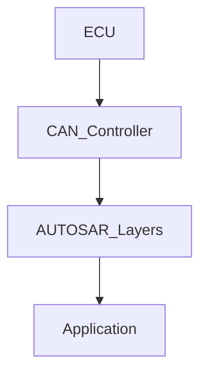

# 車用 CAN Bus 與 AUTOSAR 整合筆記

## 1. 什麼是 CAN Bus？它在車用系統的通訊角色？

**CAN Bus (Controller Area Network)** 是一種**強韌、成本效益高**的串列通訊協定，最初是為了解決汽車中眾多電子控制單元 (ECU) 之間日益複雜的線束問題而開發的。在現代汽車中，CAN Bus 扮演著**中樞神經系統**的角色，允許不同的 ECU（例如引擎控制單元、煞車系統、安全氣囊、車身控制單元等）在**不需要中央主機**的情況下互相通訊。

它的主要通訊角色包括：

- **即時資料交換**：支援 ECU 之間即時地傳輸感測器數據、控制命令和狀態資訊。
- **簡化線束**：相較於點對點的連接方式，CAN Bus 使用**兩條線路 (CAN High 和 CAN Low)** 即可連接多個 ECU，顯著減少了線束的複雜性和重量。
- **提高可靠性**：內建錯誤偵測和錯誤處理機制，確保資料傳輸的可靠性。
- **靈活性和可擴展性**：新增或移除 ECU 相對容易，不會影響到網路中其他節點的運作。
- **成本效益**：相較於其他複雜的網路協定，CAN Bus 的硬體和軟體成本相對較低。

Copperhill Technologies 專注於 CAN Bus (控制器區域網路) 技術和更高層的協定，例如 OBD-II、SAE J1939 和 CANopen [1]。他們的 PiCAN 系列 CAN Bus 板卡為 Raspberry Pi 提供了一個專業且極其可靠的 CAN Bus 開發和原型設計選項 [2]。對於需要快速原型設計且不需要作業系統的情況，他們主要依賴流行的 Arduino 平台，特別是 Arduino Due [2]。他們提供各種基於 Arduino Due 的 CAN Bus 系統，以及適用於所有其他 CPU 板類型的 CAN Bus 擴充板 [3]。

## 2. 描述 CAN Bus 資料傳輸方式、frame 格式、位元優先權

### 2.1 資料傳輸方式

CAN Bus 是一種**多主機 (multi-master)** 協定，任何連接到網路的節點都可以在匯流排空閒時發起傳輸。它使用**差動訊號**在 CAN High 和 CAN Low 線路上傳輸資料，這種方式對共模干擾具有很高的免疫力。

### 2.2 Frame 格式

CAN Bus 定義了幾種不同的 frame 格式，最常見的是：

- **Data Frame (資料框)**：用於傳輸實際的應用數據。它包含仲裁欄位（包括**訊息 ID** 和 RTR 位元）、控制欄位、資料欄位（0-8 位元組）、CRC 欄位和 ACK 欄位。
- **Remote Frame (遠程框)**：用於請求另一個節點傳輸具有特定 ID 的資料框。
- **Error Frame (錯誤框)**：由偵測到錯誤的節點發送，以通知網路中的其他節點。
- **Overload Frame (過載框)**：用於在先前的資料框或遠程框之間提供額外的延遲。

### 2.3 位元優先權

CAN Bus 使用**位元仲裁 (bit-wise arbitration)** 的機制來決定哪個節點可以獲得匯流排的存取權。當多個節點同時開始傳輸時，它們會逐位元地比較其仲裁欄位中的**訊息 ID**。

- **ID 越小，優先權越高**。
- 在仲裁過程中，發送邏輯 "1" 的節點會監聽到匯流排上的 "1"。如果它發送 "1" 但監聽到 "0"，則該節點會立即停止傳輸並成為接收者。
- 仲裁過程**不會造成任何資料遺失**，因為只有優先權最高的訊息才能繼續傳輸。

CAN FD (CAN with Flexible Data-Rate) 協定透過最小化指令和資料傳輸之間的延遲（延遲）和更高的頻寬，使應用軟體更接近「即時」。CAN FD 在 CAN Bus 資料框中提供更多的儲存容量。

## 3. AUTOSAR 架構概覽

### 3.1 Classic Platform vs. Adaptive Platform

- **Classic Platform**：專為資源受限的 ECU 設計，這些 ECU 通常執行**時間觸發 (time-triggered)** 的功能，例如感測器和致動器的基本控制。它基於**靜態配置**，並且具有明確定義的軟體層。**（此資訊非直接來自提供的文件，可能需要獨立驗證）**
- **Adaptive Platform**：專為高性能 ECU 設計，這些 ECU 需要執行更複雜的功能，例如自動駕駛、車載資訊娛樂系統和雲端連接。它支援**事件觸發 (event-triggered)** 的通訊，並且更加動態和面向服務。**（此資訊非直接來自提供的文件，可能需要獨立驗證）**

### 3.2 與 CAN 通訊模組如何整合

在 AUTOSAR Classic Platform 中，CAN 通訊的整合通常涉及以下幾個關鍵模組：

- **CAN Driver (CanDrv)**：這是**最底層**的模組，直接與 CAN 控制器硬體互動。它負責 CAN 控制器的初始化、訊息的實際傳輸和接收，以及硬體相關的配置。Copperhill Technologies 提供各種 CAN Bus 板卡，適用於 Raspberry Pi (HAT)、Arduino (Shield) 和 BeagleBone (Cape)，以及嵌入式系統的 breakout boards [3]。
- **CAN Interface (CanIf)**：CanIf 模組是 CAN Driver 的**上層介面**。它為上層模組（例如 PduR）提供**獨立於硬體的 CAN 通訊服務**。CanIf 負責管理 CAN 控制器的狀態、處理接收到的 CAN 訊息，並將它們路由到正確的上層模組，以及將上層模組的傳輸請求傳遞給 CAN Driver。
- **PDU Router (PduR)**：PduR 模組是**通訊和網路管理 PDU 的中央路由器**。它負責將來自不同上層模組（例如 Com、Nm、TP）的 PDU 路由到下層的特定介面（例如 CanIf、EthIf、LinIf），反之亦然。PduR 的配置需要定義 PDU 的路由路徑 (`PduRRoutingPath`)，包括源 PDU (`PduRSrcPdu`) 和目標 PDU (`PduRDestPdu`) 以及它們各自的 Handle ID [11]。
- **Communication (Com)**：Com 模組位於 PduR 的上層，負責處理**應用程式層的訊號和 PDU**。它將應用程式訊號打包成 PDU 進行傳輸，並將接收到的 PDU 解包成應用程式訊號。Com 模組的配置會指向 `System_Pdu` 以指示要發送的 PDU，而實際在 API 呼叫中使用的 Handle ID 由 PduR 在 `PduRSrcPdu::HandleId` 中定義 [9]。
- **Network Management (Nm)**：Nm 模組負責管理 CAN 網路的**節點狀態和喚醒/睡眠**等功能。它與 CanIf 和 PduR 互動以傳輸和接收網路管理相關的 PDU。
- **Transport Protocol (TP)**：如果需要傳輸**超過 CAN 資料框大小限制**的資料，則需要 TP 模組（例如 CanTp、J1939Tp）來負責**資料的分段和重組**。它位於 PduR 的上層，並使用底層的 CanIf 進行傳輸。

這些模組共同協作，形成 AUTOSAR Classic 平台中完整的 CAN 通訊堆疊。PduR 作為中心樞紐，負責將不同層的 PDU 導向正確的 CAN 介面進行傳輸。

## 4. AUTOSAR 通訊架構圖

## 5. AUTOSAR 中相關模組與職責

| 模組名稱 | 職責描述                                                                                                                |
| -------- | ----------------------------------------------------------------------------------------------------------------------- |
| CanDrv   | 直接控制 CAN 控制器硬體，負責底層的 CAN 訊息傳輸和接收、硬體初始化和配置                                                |
| CanIf    | 提供獨立於硬體的 CAN 通訊服務給上層模組，管理 CAN 控制器的狀態，處理 CAN 訊息的接收和傳輸請求                           |
| PduR     | 通訊和網路管理 PDU 的中央路由器，負責將來自不同上層模組的 PDU 路由到下層的特定通訊介面，反之亦然                        |
| Com      | 處理應用程式層的訊號和 PDU，負責訊號到 PDU 的打包和 PDU 到訊號的解包                                                    |
| Nm       | 管理 CAN 網路的節點狀態（例如正常運作、睡眠）和網路管理相關的功能，例如節點的加入和離開、匯流排喚醒                     |
| CanTp    | 如果需要傳輸超過 CAN 資料框大小限制的資料，負責將資料分段成較小的 CAN 資料框進行傳輸，並在接收端將其重組                |
| J1939Tp  | 針對 SAE J1939 協定，處理超過 CAN 資料框大小限制的資料分段和重組                                                        |
| ComM     | 通訊管理器，負責管理 ECU 中不同通訊通道（例如 CAN、LIN、Ethernet）的通訊模式，並協調網路管理和應用程式的需求            |
| BswM     | 基礎軟體模式管理器，負責管理 ECU 中基礎軟體模組的模式轉換，例如根據系統狀態和應用程式需求來啟用或停用不同的基礎軟體功能 |
| EcuM     | ECU 管理器，負責 ECU 的啟動、關閉和重啟等基本功能，並管理基礎軟體模組的初始化和去初始化                                 |
| Cdd      | 複雜驅動程式，用於實現標準 AUTOSAR BSW 模組無法涵蓋的特定硬體或功能                                                     |

## 6. 實際例子：Body ECU 的 CAN 資料流

假設一個 Body ECU 負責控制車輛的車燈（前大燈、尾燈、方向燈等）和車門鎖。以下是一個簡化的 CAN 資料流範例：

1. **應用程式 (Application)**：當駕駛員操作車燈開關時，Body ECU 中的應用程式會產生一個車燈控制訊號。

2. **通訊模組 (Com)**：Com 模組接收到這個車燈控制訊號，並根據預先定義的通訊矩陣，將其打包成一個 CAN PDU（例如，ID 為 0x123，包含車燈狀態資訊的 8 位元組資料）。

3. **PDU 路由器 (PduR)**：PduR 接收到來自 Com 模組的車燈控制 PDU。根據其路由配置，PduR 判斷這個 PDU 的目標是 CAN 匯流排，並將其路由到 CanIf 模組。在這個過程中，PduR 可能會為這個 PDU 分配一個內部的 Handle ID (例如 23)。

4. **CAN 介面 (CanIf)**：CanIf 接收到來自 PduR 的車燈控制 PDU 和其內部 Handle ID。CanIf 會將這個 PDU 轉換成 CAN Driver 可以處理的格式，並將其傳遞給底層的 CAN Driver。CanIf 也可能在這個階段進行一些協定相關的處理。

5. **CAN 驅動程式 (CanDrv)**：CanDrv 接收到來自 CanIf 的資料，並指示 CAN 控制器硬體將這個 CAN PDU 以 CAN frame 的格式透過 CAN High 和 CAN Low 線路發送到 CAN 匯流排上。這個 CAN frame 的 ID 將是 0x123，包含車燈狀態資訊。

6. **接收 ECU**：網路上的其他 ECU（例如前燈控制單元、後燈控制單元）會監聽 CAN 匯流排。當它們接收到 ID 為 0x123 的 CAN frame 時，它們會將其傳遞給它們各自的 CAN Driver、CanIf、PduR 和 Com 模組進行處理，最終由它們的應用程式根據 CAN frame 中的車燈狀態資訊來控制實際的車燈硬體。

類似的資料流也會發生在車門鎖的控制、方向燈的觸發等其他由 Body ECU 管理的功能上。接收 ECU 發送回饋或狀態資訊時，資料流的方向則會相反。

請注意，這是一個高度簡化的範例。實際的 CAN 資料流可能涉及更複雜的訊號打包、PDU 路由和錯誤處理機制。
