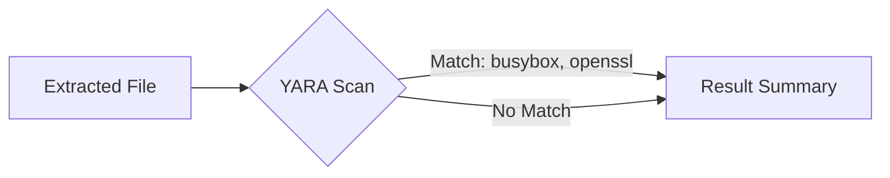

# 韌體元件偵測報告

## 1. 韌體元件功能說明

### 1.1 BusyBox

- **功能**：將許多常見的小型 Linux 命令列工具整合到單一可執行檔
- **應用場景**：嵌入式系統和系統開機時的 `initrd` 程序
- **特點**：
  - 提供 `ls`、`cp`、`mv`、`vi` 等常用命令的基本功能
  - 不同編譯版本可能包含不同的 applet（功能）
  - 體積小巧，適合資源受限的環境

### 1.2 telnetd

- **功能**：Telnet 伺服器
- **應用場景**：允許使用者透過文字介面遠端登入到伺服器
- **特點**：
  - 提供遠端管理功能
  - 可能構成安全風險（明文傳輸）

### 1.3 libcrypto

- **功能**：OpenSSL 專案中的核心加密函式庫
- **應用場景**：
  - 加密演算法實現
  - 安全通訊協定（TLS/SSL）
  - 憑證管理
- **特點**：
  - 提供底層加密運算
  - 支援對稱/非對稱加密
  - 支援雜湊演算法

## 2. YARA 規則範例

### 2.1 BusyBox 偵測規則

```yara
rule detect_busybox {
  meta:
    description = "Detect BusyBox executable"
    author = "Your Name"
    date = "2024-11-16"
  strings:
    $a = "BusyBox v" ascii wide nocase
    $b = "applets:" ascii wide nocase
  condition:
    all of ($a, $b)
}
```

### 2.2 telnetd 偵測規則

```yara
rule detect_telnetd {
  meta:
    description = "Detect telnetd executable or related strings"
    author = "Your Name"
    date = "2024-11-16"
  strings:
    $a = "telnetd" ascii wide nocase
    $b = "Telnet Server" ascii wide nocase
  condition:
    any of ($a, $b)
}
```

### 2.3 libcrypto 偵測規則

```yara
rule detect_libcrypto {
  meta:
    description = "Detect usage of libcrypto (OpenSSL)"
    author = "Your Name"
    date = "2024-11-16"
  strings:
    $a = "OpenSSL" ascii wide
    $b = "libcrypto.so" ascii wide
  condition:
    any of ($a, $b)
}
```

## 3. 掃描執行方法

### 3.1 使用 CLI 執行掃描

```bash
yara detection_rules.yar firmware.bin
```

### 3.2 使用 Python 套件執行掃描

```python
import yara

rules = yara.compile(filepath='detection_rules.yar')
matches = rules.match(data=open('firmware.bin', 'rb').read())

for match in matches:
    print(f"Match found for rule: {match.rule}")
```

## 4. 掃描流程圖



## 5. 安全風險評估

### 5.1 風險等級表

| 元件      | 功能                                         | 安全風險等級 |
| --------- | -------------------------------------------- | ------------ |
| BusyBox   | 提供多個小型 Linux 命令列工具的基本功能      | 中           |
| telnetd   | 提供 Telnet 伺服器功能，允許遠端文字介面登入 | 高           |
| libcrypto | 提供底層的加密演算法和安全通訊協定功能       | 中至高       |

### 5.2 風險說明

#### BusyBox

- 風險取決於所包含的 applet 及其漏洞
- 可能被用於執行未經授權的命令

#### telnetd

- 明文傳輸，易受竊聽和中間人攻擊
- 可能被用於未經授權的遠端訪問

#### libcrypto

- 風險來自實現漏洞（如 Heartbleed）
- 不當使用可能導致加密弱點
- 版本過舊可能包含已知漏洞
