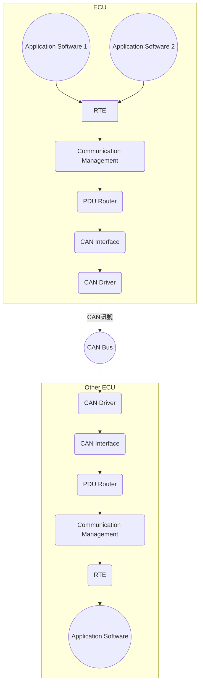

# 車用 ECU 概觀

## 1. ECU 基本概念與功能分類

### 1.1 ECU 定義

**ECU (Electronic Control Unit)**，中文稱為**電子控制單元**，是汽車中負責控制一個或多個電子系統或子系統的嵌入式系統。

### 1.2 功能分類

現代汽車中的 ECU 可依功能分為以下幾類：

#### 動力總成控制

- **Engine ECU (引擎控制單元)**

  - 控制燃油噴射
  - 控制點火系統
  - 管理排放控制
  - 優化引擎性能和效率

- **Transmission ECU (變速箱控制單元)**

  - 控制自動變速箱的換檔邏輯
  - 管理變速箱操作

- **Motor Control Unit (馬達控制單元)**
  - 控制電動車或混合動力車的驅動馬達

#### 車身電子

- **Body ECU (車身控制單元)**

  - 控制車窗、車鎖
  - 管理照明系統
  - 控制雨刷
  - 管理空調系統

- **Instrument Cluster (儀表板)**

  - 顯示車速
  - 顯示引擎轉速
  - 顯示油量等車輛資訊

- **Airbag Control Unit (氣囊控制單元)**
  - 在碰撞發生時觸發安全氣囊

#### 底盤控制

- **Brake ECU (煞車控制單元)**

  - 控制 ABS (防鎖死煞車系統)
  - 控制 ESP (電子穩定程序)

- **Steering ECU (轉向控制單元)**

  - 控制電子助力轉向系統

- **Suspension ECU (懸吊控制單元)**
  - 控制主動懸吊系統
  - 提高行駛舒適性和操控性

#### 資訊娛樂系統

- **Head Unit (主機)**

  - 提供音訊功能
  - 提供導航功能
  - 提供媒體播放
  - 顯示車輛資訊

- **Telematics ECU (車載資通訊單元)**
  - 提供網路連接
  - 提供緊急呼叫
  - 提供遠程診斷

#### 駕駛輔助系統

- **Camera ECU (攝影機控制單元)**

  - 處理車載攝影機影像
  - 支援環景監控
  - 支援車道保持輔助

- **Radar ECU (雷達控制單元)**
  - 處理雷達感測器數據
  - 支援自動緊急煞車
  - 支援 ACC (主動巡航控制)

## 2. CAN Bus 通訊關係

### 2.1 CAN Bus 簡介

**CAN Bus (Controller Area Network)** 是一種常見的車用網路技術，用於實現不同 ECU 之間的互相通訊。

### 2.2 通訊流程

1. **ECU 產生訊息**

   - 將資訊封裝成 CAN 訊息
   - 包含訊息 ID 和數據內容

2. **訊息傳送至 CAN Bus**

   - 透過兩線式匯流排系統傳輸

3. **所有 ECU 接收訊息**

   - 所有連接的 ECU 都會收到訊息

4. **ECU 判斷是否處理**

   - 根據訊息 ID 判斷是否為目標訊息
   - 是：解析並處理數據
   - 否：忽略該訊息

5. **執行相應操作**
   - 控制硬體
   - 更新內部狀態

## 3. AUTOSAR 架構與 ECU 角色

### 3.1 AUTOSAR 簡介

**AUTOSAR (AUTomotive Open System ARchitecture)** 是一個開放的汽車軟體架構標準，旨在：

- 提高複雜性管理
- 提升軟體可重用性
- 增強可交換性

### 3.2 ECU 軟體層級

1. **應用層 (Application Layer)**

   - 包含特定車輛功能
   - 實現軟體組件

2. **運行時環境 (Runtime Environment, RTE)**

   - 提供應用層通訊
   - 抽象底層硬體細節

3. **基礎軟體 (Basic Software, BSW)**

   - 系統服務
   - 記憶體管理
   - 通訊堆疊
   - I/O 硬體抽象

4. **複雜驅動 (Complex Drivers)**
   - 控制特殊硬體

### 3.3 ECU 配置流程

1. **輸入**

   - ECU 提取
   - BSW 模組交付包

2. **處理**

   - 準備 ECU 配置
   - 配置 BSW 和 RTE

3. **輸出**
   - ECU 配置值
   - 其他相關文件

## 4. 通訊堆疊示意圖

### 4.1 通訊流程說明

1. 應用軟體通過 RTE 傳遞資料
2. 通訊管理模組處理資料
3. PDU 路由器進行路由
4. CAN 介面處理 PDU
5. CAN 驅動程式進行傳輸
6. 接收端 ECU 接收訊號
7. 反向處理流程

## 5. 常見 ECU 用途對照表

| ECU 類型           | 主要用途                   |
| ------------------ | -------------------------- |
| Body ECU           | 控制車身舒適性和便利性功能 |
| Engine ECU         | 控制引擎性能和效率         |
| Transmission ECU   | 控制變速箱操作             |
| Brake ECU          | 控制煞車安全系統           |
| Steering ECU       | 控制轉向系統               |
| Instrument Cluster | 顯示車輛資訊               |
| Infotainment       | 提供多媒體功能             |
| Airbag ECU         | 控制安全氣囊               |
| Gateway ECU        | 連接不同網路               |
