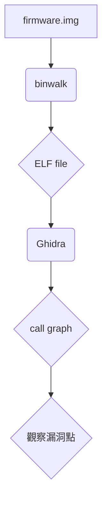

# 韌體逆向工程分析

本文件將介紹如何對韌體進行逆向工程分析，主要涵蓋使用 `binwalk` 進行解包、使用 `Ghidra` 或 `IDA Pro` 進行靜態分析，以及在 ELF/ARM 二進制檔案中尋找關鍵元素。

## 1. 使用 binwalk 進行韌體解包

### 1.1 Binwalk 簡介

**Binwalk** 是一款用於搜尋二進制映像檔中嵌入檔案和可執行代碼的工具。它特別設計用於識別韌體映像中的檔案和代碼。

### 1.2 解包過程

使用 `-e` 選項進行自動提取：

```bash
binwalk -e firmware.img
```

### 1.3 注意事項

- **遺失的提取工具**

  - 可能需要安裝額外的提取工具
  - 確保所有依賴項都已安裝

- **符號連結處理**

  - 注意符號連結的處理方式
  - 確保連結正確解析

- **輸出目錄管理**

  - 確保有足夠的磁碟空間
  - 確認寫入權限

- **大型檔案處理**
  - 解包大型韌體可能需要較長時間
  - 建議使用高性能硬體

## 2. 靜態分析工具

### 2.1 Ghidra 分析流程

1. **啟動 Ghidra**

   - 運行 `ghidraRun.bat` (Windows)
   - 運行 `ghidraRun` (Linux/macOS)

2. **創建新專案**

   - 選擇 `File -> New Project`
   - 創建 `Non-shared Project`

3. **匯入二進制檔案**

   - 選擇 `File -> Import File...`
   - 選擇解包後的 ELF 檔案

4. **選擇處理器**

   - 根據目標韌體選擇正確的架構
   - 設定 endianness

5. **分析二進制檔案**

   - 使用預設設定或自訂選項
   - 點擊 `Analyze` 開始分析

6. **檢視分析結果**

   - 查看反組譯程式碼
   - 檢查函數列表和符號表

7. **使用反編譯器**
   - 在 `Listing` 視窗選中函數
   - 按下 `P` 鍵查看偽代碼

### 2.2 IDA Pro 分析流程

1. **啟動 IDA Pro**

   - 運行 IDA Pro 可執行檔

2. **載入檔案**

   - 選擇 `File -> Load file`
   - 選擇要分析的二進制檔案

3. **配置載入器**

   - 確認檔案類型和處理器架構
   - 必要時手動配置選項

4. **等待自動分析**

   - 讓 IDA Pro 執行初步分析

5. **檢視反組譯結果**

   - 在 `IDA View` 視窗查看結果
   - 使用 `Space` 鍵切換視圖

6. **使用反編譯器**
   - 選中函數後按 `F5`
   - 在 `Pseudocode` 視窗查看結果

## 3. 關鍵元素搜尋

### 3.1 尋找 main 函數

- **Ghidra**

  - 在 `Symbol Tree` 視窗展開 `Functions`
  - 尋找 `main` 或 `entry` 函數

- **IDA Pro**
  - 在 `Functions window` 尋找 `main`
  - 檢查程序入口點

### 3.2 尋找字串

- **strings 工具**

  ```bash
  strings -n 7 firmware.bin | less
  strings -t x firmware.bin
  ```

- **Ghidra**

  - 打開 `Window -> Defined Strings`
  - 使用 `Search -> For String...`

- **IDA Pro**
  - 打開 `Strings window`
  - 查看識別的字串

### 3.3 尋找 libc 呼叫

- **Ghidra**

  - 尋找常見 libc 函數呼叫
  - 檢查 `External Symbols` 目錄

- **IDA Pro**
  - 查看 `Imports` 視窗
  - 分析函數參數和返回值

## 4. 分析流程圖



## 5. 可疑函數分析

### 5.1 需要特別關注的函數類型

- **字串操作函數**

  - strcpy、sprintf、strcat
  - 可能導致緩衝區溢出

- **記憶體操作函數**

  - memcpy、memmove
  - 可能導致越界讀寫

- **網路相關函數**

  - socket、bind、listen
  - accept、connect、recv、send

- **輸入驗證相關函數**

  - 缺乏或不當的輸入驗證

- **特權操作相關函數**

  - 執行提升權限的操作

- **加密相關函數**

  - 使用弱加密算法
  - 不安全的加密實作

- **硬體互動函數**

  - 與硬體相關的漏洞

- **敏感資訊處理函數**

  - 包含 password、secret、key 等關鍵字

- **高風險服務相關函數**
  - 與 telnetd 等服務相關

## 6. Ghidra 快照管理

### 6.1 保存快照

1. 調整 Ghidra 視圖到所需狀態
2. 使用系統截圖工具
3. 保存到 `screenshots/` 目錄

### 6.2 引用快照

```markdown

```

## 7. 結論

韌體逆向工程是一個複雜但至關重要的過程，可以幫助我們：

- 理解嵌入式系統的運作方式
- 發現潛在的安全漏洞
- 深入了解韌體的內部結構
- 分析程式邏輯
- 為安全分析和漏洞挖掘奠定基礎
