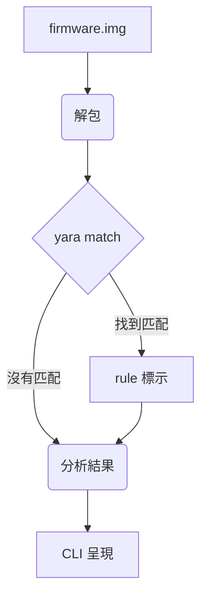

# Firmware 掃描工具使用指南

## 1. 工具概述

本工具是一個 Python CLI 應用程式，用於自動化韌體映像檔案 (`firmware.img`) 的安全分析流程。透過整合解包、YARA 規則掃描和結果分析功能，幫助使用者快速識別韌體中的潛在風險。

## 2. 功能說明

### 2.1 主要功能

- **韌體映像處理**：支援多種韌體格式的輸入
- **自動解包**：使用 Binwalk 進行韌體解包
- **YARA 掃描**：對解包檔案進行規則匹配
- **風險分析**：評估並呈現組件風險等級

## 3. 安裝與設定

### 3.1 環境需求

- Python 3.x
- pip 套件管理工具

### 3.2 必要套件安裝

1. **安裝 yara-python**

   ```bash
   pip install yara-python
   ```

2. **安裝 ClamAV (選用)**
   ```bash
   sudo apt-get install clamav clamav-daemon clamav-freshclam
   ```

### 3.3 使用方式

```bash
python firmware_scan.py <韌體映像檔案路徑>
```

## 4. 使用範例

### 4.1 基本掃描

```bash
$ python firmware_scan.py ./firmware_samples/fw.img
✅ Found: busybox, openssl
🔍 Risk Level: Medium
```

### 4.2 YARA 規則範例

```yara
rule detect_busybox {
  meta:
    author = "Your Name"
    description = "Detects the presence of busybox"
    date = "2024-05-16"
  strings:
    $busybox_string = "BusyBox v" ascii wide nocase
  condition:
    $busybox_string
}
```

### 4.3 輸出格式

```json
{
  "firmware_path": "./firmware_samples/fw.img",
  "scan_timestamp": "2024-05-16T10:30:00Z",
  "unpacked_files": [
    "filesystem/bin/busybox",
    "filesystem/usr/lib/libssl.so.1.1"
  ],
  "yara_matches": [
    {
      "rule": "detect_busybox",
      "namespace": "default",
      "strings": [
        {
          "identifier": "$busybox_string",
          "offset": 12345,
          "matched_string": "BusyBox v1.30.1"
        }
      ],
      "file": "filesystem/bin/busybox"
    }
  ],
  "detected_components": [
    {
      "name": "busybox",
      "version": "1.30.1",
      "risk_indicators": ["common in embedded systems"],
      "risk_level": "Low"
    }
  ],
  "overall_risk_level": "Medium"
}
```

## 5. 工作流程



## 6. 未來擴充方向

### 6.1 AI 整合

- 機器學習模型整合
- 異常行為檢測
- 漏洞預測

### 6.2 解包功能擴充

- 支援更多韌體格式
- 整合特定嵌入式系統解包工具

### 6.3 分析工具整合

- 整合 Ghidra 等靜態分析工具
- 識別已知漏洞

### 6.4 動態分析

- 與 QEMU 整合
- 執行時行為監控

### 6.5 風險評估

- 自定義評估標準
- 調整風險權重

### 6.6 報表功能

- 多格式輸出支援
- PDF、HTML、Markdown

### 6.7 威脅情報

- 威脅情報資料庫整合
- 提高風險判斷準確性
