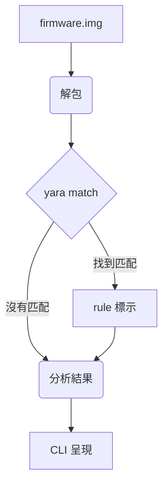

# Firmware 掃描工具使用指南

本文件將引導您使用自行開發的 Python CLI 工具，該工具旨在簡化韌體映像檔案 (`firmware.img`) 的安全分析流程。透過自動化的解包、YARA 規則掃描和結果分析，您可以快速了解韌體中可能存在的風險。

## 1. 功能說明

本工具的主要功能如下：

1. **接受韌體映像檔案**：使用者可以透過命令列指定要分析的韌體映像檔案路徑
2. **韌體解包**：使用 Binwalk 工具解包韌體映像檔案，提取其中的檔案和目錄
3. **YARA 規則掃描**：對解包後的檔案進行 YARA 規則掃描
4. **結果分析**：分析掃描結果，以易於理解的格式呈現可疑組件及其風險等級

## 2. 安裝方式與使用說明

### 2.1 環境依賴

在使用本工具之前，請確保您的系統已安裝以下軟體和函式庫：

- **Python 3**：本工具基於 Python 開發
- **pip**：Python 的套件管理工具

### 2.2 安裝 yara-python

使用 pip 安裝 `yara-python` 函式庫：

```bash
pip install yara-python
```

### 2.3 安裝 ClamAV (可選)

在 Ubuntu 或 Debian 上安裝 ClamAV：

```bash
sudo apt-get install clamav clamav-daemon clamav-freshclam
```

### 2.4 使用說明

執行韌體掃描：

```bash
python firmware_scan.py <韌體映像檔案路徑>
```

## 3. 範例 CLI 執行

執行範例：

```bash
$ python firmware_scan.py ./firmware_samples/fw.img
✅ Found: busybox, openssl
🔍 Risk Level: Medium
```

## 4. YARA 規則與輸出格式

### 4.1 YARA 規則範例

```yara
rule detect_busybox {
  meta:
    author = "Your Name"
    description = "Detects the presence of busybox"
    date = "2024-05-16"
  strings:
    $busybox_string = "BusyBox v" ascii wide nocase
  condition:
    $busybox_string
}
```

### 4.2 JSON 輸出格式範例

```json
{
  "firmware_path": "./firmware_samples/fw.img",
  "scan_timestamp": "2024-05-16T10:30:00Z",
  "unpacked_files": [
    "filesystem/bin/busybox",
    "filesystem/usr/lib/libssl.so.1.1"
  ],
  "yara_matches": [
    {
      "rule": "detect_busybox",
      "namespace": "default",
      "strings": [
        {
          "identifier": "$busybox_string",
          "offset": 12345,
          "matched_string": "BusyBox v1.30.1"
        }
      ],
      "file": "filesystem/bin/busybox"
    }
  ],
  "detected_components": [
    {
      "name": "busybox",
      "version": "1.30.1",
      "risk_indicators": ["common in embedded systems"],
      "risk_level": "Low"
    }
  ],
  "overall_risk_level": "Medium"
}
```

## 5. 整體流程圖



## 6. 可擴充方向

本工具未來可以朝以下方向進行擴充：

1. **AI 模組整合**

   - 整合機器學習模型
   - 異常行為檢測
   - 漏洞預測

2. **更豐富的解包支援**

   - 支援更多韌體格式
   - 整合特定嵌入式系統解包工具

3. **靜態分析工具整合**

   - 整合 Ghidra 等工具
   - 識別已知漏洞

4. **動態分析支援**

   - 與 QEMU 整合
   - 執行時行為監控

5. **客製化風險評估**

   - 自定義評估標準
   - 調整風險權重

6. **報表輸出**

   - 支援多種格式
   - PDF、HTML、Markdown

7. **威脅情報整合**
   - 與威脅情報資料庫比對
   - 提高風險判斷準確性
