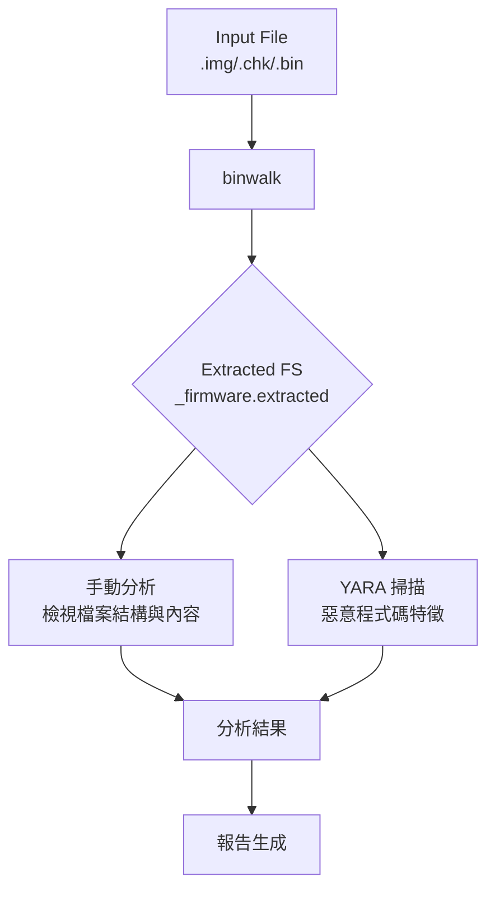

# 韌體解包分析筆記

## 1. binwalk 的作用與使用方式

**binwalk** 是一個用於**分析和提取韌體映像及嵌入式檔案系統**的工具。它透過掃描二進制檔案中的**檔案簽名**，可以識別檔案中嵌入的不同組件，例如檔案頭、壓縮檔案、檔案系統、核心和啟動載入器等。binwalk 被廣泛應用於逆向工程、網路安全和鑑識領域。

### 1.1 基本使用方式

binwalk 的基本用法是在終端機中執行 `binwalk` 命令，後面接著要分析的韌體檔案路徑。

例如，要對一個名為 `firmware.bin` 的韌體檔案進行簽名掃描：

```bash
binwalk firmware.bin
```

### 1.2 提取檔案

要提取韌體中識別到的檔案和檔案系統，可以使用 `-e` 參數：

```bash
binwalk -e firmware.bin
```

這個指令會在目前目錄下建立一個名為 `_firmware.bin.extracted` 的資料夾，並將提取到的內容放置於其中。

### 1.3 支援的檔案格式

- **支援多種韌體檔案格式**

  - `.img`
  - `.chk`
  - `.bin`
  - 其他常見格式

- **底層技術**
  - 使用 libmagic 庫
  - 相容 Unix file 工具的 magic 簽名

## 2. 解包指令範例

### 2.1 掃描韌體

```bash
binwalk firmware.chk
```

這個指令會掃描 firmware.chk 並列出其中識別到的組件。

### 2.2 解包韌體

```bash
binwalk -e firmware.chk
```

執行這個指令後，binwalk 會在目前目錄下建立一個名為 `_firmware.chk.extracted` 的資料夾，其中包含解包後的檔案和目錄。

## 3. 解包後常見的目錄結構

解包韌體後，常見的目錄結構會反映原始韌體內部的檔案系統。以下是一些常見的目錄及其內容：

### 3.1 系統目錄

- **/bin**

  - 基本系統命令和可執行檔案
  - 例如：sh (shell)、ls、cp 等
  - 系統運作所必需的基本工具程式

- **/lib**

  - 系統和應用程式使用的函式庫檔案
  - 包含可被多個程式共用的程式碼
  - 例如：C 語言的標準函式庫 libc.so

- **/etc**

  - 系統的設定檔
  - 包含網路配置、系統服務配置
  - 使用者帳號資訊等

- **/sbin**
  - 系統管理員使用的特權命令
  - 例如：mount、ifconfig 等

### 3.2 使用者目錄

- **/usr**

  - 使用者應用程式和相關檔案
  - 包含 bin、lib、share 等子目錄

- **/var**

  - 變動的資料
  - 包含日誌檔案、暫存檔案
  - Spooler 目錄等

- **/tmp**
  - 臨時檔案
  - 系統重新啟動時可能被清除

### 3.3 其他重要檔案

- 啟動腳本 (init)
- 核心映像檔 (vmlinuz)
- 裝置節點 (dev 目錄)

## 4. 韌體分析流程圖



## 5. 韌體來源與類型

### 5.1 韌體來源

- **網路設備**

  - 路由器
  - 交換器
  - 防火牆

- **消費性電子產品**

  - 智能家電
  - 攝影機
  - 電視機

- **嵌入式系統**
  - 工業控制系統
  - 醫療設備
  - 汽車電子

### 5.2 韌體類型

- **完整的設備韌體映像**

  - 包含整個系統的檔案
  - 包含可執行程式

- **韌體更新檔案**

  - 只包含需要更新的組件

- **Bootloader**

  - 負責啟動作業系統的程式碼

- **核心映像檔**

  - 作業系統的核心部分

- **檔案系統映像檔**
  - 包含檔案和目錄結構的映像

## 6. 分析工具使用

### 6.1 strings 工具

strings 命令可以從二進制檔案中提取可讀的字串，對於快速了解韌體中可能包含的資訊非常有用：

- **版本資訊和建構日期**

  - 判斷韌體的年代
  - 識別可能存在的已知漏洞

- **檔案路徑和名稱**

  - 揭示程式可能的組織結構
  - 了解功能分佈

- **URL 和 IP 位址**

  - 識別韌體嘗試連線的網路資源

- **錯誤訊息和除錯資訊**

  - 提供程式運作時的線索

- **硬體相關字串**

  - 晶片型號
  - 介面名稱

- **加密相關字串**
  - 演算法名稱
  - 加密功能提示

#### 6.1.1 使用範例

```bash
# 提取長度至少為 7 個字元的字串
strings -n 7 firmware.bin | less

# 搜尋特定關鍵字
strings -n 7 firmware.bin | grep "http://"

# 顯示字串在檔案中的十六進制位址
strings -t x firmware.bin
```

### 6.2 hexdump 工具

hexdump 命令以十六進制或其他格式顯示檔案的原始二進制資料，對於深入理解檔案的結構和內容非常重要：

#### 6.2.1 檔案頭和元數據分析

- **Magic Number 識別**

  - 常見的檔案格式標識：
    - ELF 檔案：`7F 45 4C 46`
    - PE 檔案：`4D 5A`
    - JPEG：`FF D8 FF`
    - PNG：`89 50 4E 47`
  - 使用方式：
    ```bash
    # 查看檔案前 16 個位元組
    hexdump -n 16 -C firmware.bin
    ```
  - 實際應用：
    - 快速識別檔案類型
    - 驗證檔案完整性
    - 檢測檔案是否被篡改

- **檔案格式標識**
  - 檢查檔案頭結構
  - 分析版本資訊
  - 驗證檔案完整性

#### 6.2.2 二進制結構和資料格式分析

- **資料儲存方式分析**

  - 位元組序（Endianness）判斷
    - 大端序（Big Endian）：高位元組在前
    - 小端序（Little Endian）：低位元組在前
  - 資料對齊方式
  - 結構體佈局

- **資料排布分析**
  - 使用 `-v` 選項顯示所有資料
  - 使用 `-s` 選項跳過指定偏移
  - 使用 `-e` 選項自定義格式

#### 6.2.3 二進制模式識別

- **程式碼片段識別**

  - 函數序言（Function Prologue）
  - 系統呼叫特徵
  - 跳轉指令模式

- **惡意程式碼特徵分析**
  - 已知惡意程式碼特徵
  - 可疑的 API 呼叫
  - 異常的程式碼結構

#### 6.2.4 檔案比較分析

- **差異分析**

  ```bash
  # 比較兩個韌體版本
  hexdump -C firmware_v1.bin > v1.txt
  hexdump -C firmware_v2.bin > v2.txt
  diff v1.txt v2.txt
  ```

  - 使用 `-d` 選項進行差異比較
  - 使用 `-s` 選項跳過相同部分

- **韌體更新分析**
  - 識別更新區域
  - 分析更新內容
  - 驗證更新完整性

#### 6.2.5 進階功能

- **自定義輸出格式**

  ```bash
  # 自定義格式顯示
  hexdump -e '8/1 "%02X " "\n"' firmware.bin
  ```

- **偏移量顯示**

  ```bash
  # 顯示偏移量
  hexdump -C -n 64 firmware.bin
  ```

- **搜尋特定模式**

  ```bash
  # 搜尋特定十六進制模式
  hexdump -C firmware.bin | grep "FF D8"
  ```

- **檔案切片分析**
  ```bash
  # 分析特定區域
  hexdump -C -s 0x1000 -n 256 firmware.bin
  ```

#### 6.2.6 實際應用案例

- **韌體分析**

  - 識別韌體結構
  - 分析更新機制
  - 檢測安全漏洞

- **惡意程式碼分析**

  - 識別可疑程式碼
  - 分析惡意行為
  - 提取特徵碼

- **檔案修復**
  - 修復損壞的檔案頭
  - 恢復被篡改的資料
  - 驗證修復結果

#### 6.2.7 使用範例

```bash
# 基本使用：以規範的十六進制和 ASCII 格式顯示檔案內容
hexdump -C firmware.bin | less

# 進階使用：自定義格式顯示特定區域
hexdump -e '16/1 "%02X " "  |" 16/1 "%_p" "|\n"' -s 0x1000 -n 256 firmware.bin

# 比較分析：顯示兩個檔案的差異
hexdump -C firmware_v1.bin > v1.txt
hexdump -C firmware_v2.bin > v2.txt
diff v1.txt v2.txt
```
