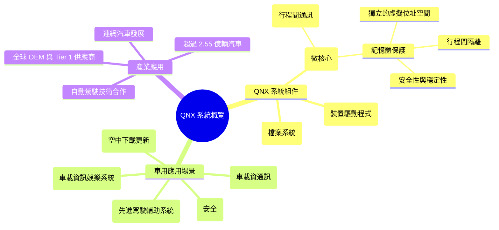

# QNX 系統概覽

## 1. 什麼是 QNX？它作為 RTOS 的特性有哪些？

**QNX 是一個高效能的嵌入式即時作業系統（Real-Time Operating System, RTOS）** [1, 2]。與傳統作業系統將大部分核心功能整合在一個巨大的程式中（單核心，monolithic kernel）不同，QNX 採用**微核心（microkernel）架構** [3, 4]。在這種架構下，大部分的作業系統服務（例如檔案系統、網路協定、裝置驅動程式）都以獨立的使用者空間行程（user-space processes）的形式運行，只有最核心的功能（如行程排程、行程間通訊、記憶體管理）保留在微核心中 [3-5]。

作為一個 RTOS，QNX 具有以下關鍵特性 [1, 2, 4, 6-10]：

- **微核心可靠性 (Microkernel Reliability)**：由於程式、驅動程式、協定堆疊和檔案系統都隔離在各自的位址空間中，因此一個組件的故障不會影響到核心或其他組件的運行，失敗的組件可以立即重新啟動，而不會影響效能 [4]。
- **即時可用性 (Real-Time Availability)**：QNX 能夠在需要時確保系統資源的可用性，並按時完成任務，對於需要嚴格時間限制的應用至關重要 [4, 10]。
- **安全 (Security)**：QNX 以其強大的安全模型和受限的攻擊面而聞名，其微核心架構和隔離的進程有助於減少安全威脅 [4, 6, 7, 10, 11]。
- **確定性效能 (Deterministic Performance)**：QNX 提供多種排程選項，可以優先處理關鍵任務，並確保重要的處理器獲得所需的 CPU 週期，而不會影響系統的整體效能 [4]。
- **受保護的記憶體存取 (Protected Memory Access)**：QNX 使用 IOMMU 或 SMMU 管理器來防止未經授權的直接記憶體存取（DMA），限制對匯流排裝置的存取，並監控和控制邊界違規 [4]。
- **小巧的記憶體佔用 (Small Footprint)**：相較於較大的作業系統（如 Windows 或 Linux），QNX 的記憶體佔用較小，處理器負載也較低，因此更有效率 [10, 12-14]。
- **高可靠性 (High Reliability)**：QNX 以其高度的穩定性和可靠性而聞名，這使其成為需要零停機時間的任務關鍵型系統的理想選擇 [9, 10, 12]。
- **可擴展性 (Scalability)**：QNX 的微核心架構可以應用於各種產品線，開發人員可以專注於增加價值的功能，而不是作業系統的維護 [8, 11, 12]。

## 2. 為何 QNX 被廣泛用於車用系統（如 IVI、ADAS、TCU 等）？

QNX 之所以被廣泛應用於車用系統，主要是因為其作為 RTOS 的核心特性非常符合汽車產業對軟體的要求 [1, 2, 9, 11, 12]:

- **安全性 (Safety)**：汽車系統，尤其是 ADAS（Advanced Driver-Assistance Systems，先進駕駛輔助系統），對安全性有極高的要求。QNX 的微核心架構和記憶體保護機制能夠提供更安全的運行環境，減少因軟體錯誤導致的潛在風險 [2, 4, 6-11]。QNX 提供預先通過安全認證的產品變體，有助於加速汽車製造商的認證工作 [6-8]。
- **即時性 (Real-Time Performance)**：車用系統中的許多組件，例如引擎控制單元、煞車系統和 ADAS 感測器，都需要快速且可靠地回應事件。QNX 的即時效能確保這些關鍵任務能夠在嚴格的時間限制內完成 [4, 8, 10-12]。
- **可靠性 (Reliability)**：汽車環境複雜多變，車載系統需要長時間穩定運行。QNX 的微核心架構和進程隔離特性提高了系統的整體可靠性，降低了系統崩潰的風險 [9, 10, 12]。
- **靈活性和可擴展性 (Flexibility and Scalability)**：QNX 的模組化設計使得汽車製造商可以根據不同的車型和功能需求，選擇性地包含所需的組件，並在未來輕鬆添加新功能 [2, 8, 11, 12]。QNX 可以支援各種硬體平台 [4]。
- **成熟的生態系統和工具 (Mature Ecosystem and Tools)**：QNX 已經在嵌入式系統領域深耕多年，擁有成熟的開發工具和完善的支援服務，這有助於汽車製造商加快產品開發週期 [2, 7, 15]。

QNX 被廣泛應用於以下車用場景 [5, 9, 11, 12, 16]：

- **IVI (In-Vehicle Infotainment，車載資訊娛樂系統)**：提供導航、影音娛樂、車輛資訊等功能。
- **ADAS (Advanced Driver-Assistance Systems，先進駕駛輔助系統)**：例如自動泊車、車道保持輔助、自動緊急煞車等。
- **TCU (Telematics Control Unit，車載資通訊控制單元)**：負責車輛與外部網路的通訊，例如 OTA (Over-The-Air) 更新、緊急呼叫等。
- **數位儀表板 (Digital Cockpit)**：取代傳統的指針式儀表，顯示車速、轉速等行車資訊。
- **音響系統 (QNX Sound)**：提供高品質的車內音訊體驗 [16]。

## 3. 與傳統 OS（如 Linux）有何不同？

QNX 與傳統作業系統（例如 Linux）在架構和設計理念上存在顯著差異 [3, 10, 12-14]：

| 特性           | QNX                                                                          | Linux                                                                           |
| -------------- | ---------------------------------------------------------------------------- | ------------------------------------------------------------------------------- |
| **核心架構**   | **微核心 (Microkernel)**：大部分服務運行在使用者空間，核心只負責最基本的功能 | **單核心 (Monolithic Kernel)**：所有核心服務都整合在一個巨大的核心中            |
| **即時性**     | **優秀 (Excellent)**：專為即時應用設計，提供確定性效能和低延遲               | **較差 (Less Ideal)**：雖然有即時擴充，但核心複雜性可能導致更高的延遲和不確定性 |
| **安全性**     | **強 (Strong)**：進程隔離和微核心架構提供了更強的安全性                      | **相對較弱 (Relatively Weaker)**：單核心架構的任何漏洞都可能影響整個系統        |
| **可靠性**     | **高 (High)**：模組化設計和進程隔離提高了系統的穩定性                        | **較低 (Lower)**：核心中的錯誤可能導致整個系統崩潰                              |
| **記憶體佔用** | **小 (Small)**：微核心架構使得記憶體佔用更小                                 | **大 (Large)**：單核心包含所有服務，記憶體佔用相對較大                          |
| **靈活性**     | **高 (High)**：可以根據需求選擇性地包含所需組件                              | **較低 (Lower)**：核心功能緊密耦合，客製化可能更複雜                            |
| **授權方式**   | **商業授權 (Commercial License)**：通常需要付費                              | **開源 (Open Source)**：大部分情況下免費使用和修改                              |

## 4. QNX 系統組件與車用應用場景（Mermaid Mindmap）

## QNX 系統架構與記憶體保護模型

QNX 的核心架構基於 Neutrino 微核心。這個微核心只提供最基本的操作，例如行程管理、執行緒管理、行程間通訊（IPC）和低階硬體介面。所有的系統服務，包括檔案系統、網路堆疊、裝置驅動程式等，都以獨立的 使用者空間行程 的形式運行。

QNX 的 記憶體保護模型 是其安全性和可靠性的關鍵。由於每個使用者空間行程都運行在 獨立的虛擬位址空間 中，因此一個行程無法直接存取另一個行程的記憶體空間。核心負責管理這些位址空間，並確保行程之間的隔離。這種 記憶體保護 機制可以防止一個錯誤的應用程式或驅動程式損壞其他部分的系統，提高了系統的整體穩定性。行程之間需要透過微核心提供的 行程間通訊（IPC）機制 來交換資料和訊息，這有助於控制資訊的流動並增強安全性。

## 產業應用現況

QNX 被全球的 OEM（Original Equipment Manufacturers，原始設備製造商）和 Tier 1 供應商廣泛信任，並應用於超過 2.55 億輛汽車中。這涵蓋了資訊娛樂系統、數位儀表板、ADAS 等多個方面。由於商業保密等原因，具體的合作夥伴和使用細節可能不會公開揭露在這些技術文件中。

QNX 持續在汽車領域發展，以滿足不斷變化的產業需求，例如連網汽車和自動駕駛技術。QNX 正在積極參與自動駕駛汽車的開發，並與多家汽車製造商合作。
